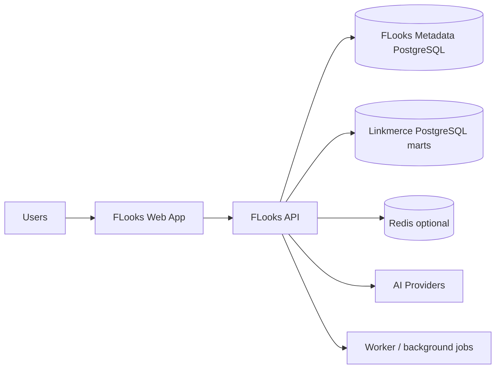

# FLooks Platform Dossier

이 문서는 FLooks의 현재 구조, 기술 선택 이유, 배제하거나 보류한 대안, 그리고 향후 구현 계획까지 한 번에 설명하는 종합 문서다.

핵심 메시지는 단순하다. FLooks는 신생 도구 실험 위에 세우는 제품이 아니라, 2026년 현재도 활발히 유지되고 있고 채용과 운영 측면에서 검증된 메이저 도구 위에 세우는 내부용 엔터프라이즈 대시보드 플랫폼이다.

## 1. Executive Summary

FLooks는 Linkmerce가 만드는 분석 데이터를 기업 내부에서 안전하게 소비하고, 부서/팀/권한/데이터 가시성 규칙까지 포함해 운영할 수 있는 대시보드 플랫폼을 목표로 한다.

현재 권장 구조는 다음과 같다.

- 프론트엔드: React + TypeScript + Vite SPA
- 라우팅: React Router
- 비동기 데이터 상태: TanStack Query
- 표: TanStack Table
- 차트: Apache ECharts
- UI primitive: Tailwind CSS + Radix UI 계열 조합
- 백엔드 API: FastAPI
- ORM / 마이그레이션: SQLAlchemy 2.x + Alembic + psycopg 3
- 메타데이터 DB: PostgreSQL
- 개발/운영 시작점: Docker Compose
- Kubernetes 이행 경로: Helm chart skeleton

이 조합을 선택한 이유는 네 가지다.

1. 모두 대중적이고 활발히 유지되는 도구다.
2. Linkmerce, Airflow, dbt, PostgreSQL 기반 현실과 자연스럽게 연결된다.
3. 1인 개발 단계에서 지나치게 무겁지 않으면서 팀 확장도 막지 않는다.
4. 대시보드 편집기, 코드 기반 대시보드, 권한 기반 데이터 노출, AI 하네스 같은 FLooks 고유 요구사항을 직접 구현하기에 적합하다.

## 2. Decision Principles

기술 선택은 기능 선호가 아니라 아래 기준으로 판단한다.

### 2.1 메이저 생태계 우선

- 널리 쓰이는가
- 공식 문서와 릴리스 흐름이 살아 있는가
- 장기 유지보수 인력이 시장에 충분한가

### 2.2 도메인 적합성

- 커머스 분석 대시보드에 필요한 표, 차트, 필터, 편집기를 무리 없이 구현할 수 있는가
- 데이터 권한과 객체 가시성 규칙을 강하게 강제할 수 있는가

### 2.3 운영 복잡도 통제

- 사내 사용자 규모에서 과도한 분산 시스템을 강요하지 않는가
- Docker Compose 단계에서 충분히 운영하고, 필요할 때 Helm/Kubernetes로 옮길 수 있는가

### 2.4 Linkmerce와의 정합성

- Python 데이터 생태계와 자연스럽게 맞물리는가
- Linkmerce PostgreSQL mart를 읽기 전용으로 소비하기 쉬운가

### 2.5 오픈소스 전환 가능성

- 특정 벤더나 관리형 서비스에 깊게 묶이지 않는가
- 이후 connector, panel, harness pack API를 공개 계약으로 만들 수 있는가

## 3. Stack Decisions

이 섹션은 “현재 저장소에 이미 들어간 것”과 “다음 구현 파동에서 바로 추가할 것”을 구분한다.

| 영역 | 현재 부트스트랩 | 다음 구현 파동의 고정 권장안 | 이유 |
| --- | --- | --- | --- |
| Frontend shell | React + TypeScript + Vite | 유지 | 인증 뒤 편집기 중심 제품이라 SSR보다 상호작용 성능과 단순성이 중요하다. |
| Routing | 미도입 | React Router | React 생태계 표준이며 Vite SPA와 조합이 안정적이다. |
| Async data | 미도입 | TanStack Query | 캐시, 리패치, 폴링, optimistic update, devtools까지 메이저 표준이다. |
| Table runtime | 미도입 | TanStack Table | 헤드리스 구조라 FLooks의 커스텀 표 요구에 잘 맞는다. |
| Chart runtime | 미도입 | Apache ECharts | 엔터프라이즈 대시보드에 필요한 차트 범위와 확장성이 충분하다. |
| UI primitives | 미도입 | Tailwind CSS + Radix UI 계열 | 잘 알려진 조합이며 디자인 자유도와 접근성 균형이 좋다. |
| Backend API | FastAPI skeleton | 유지 | Python 데이터 생태계와 정합성이 높고 생산성이 높다. |
| ORM | 미도입 | SQLAlchemy 2.x | Python에서 가장 검증된 ORM / SQL toolkit이다. |
| Migrations | 미도입 | Alembic | SQLAlchemy와 사실상 표준 조합이다. |
| PostgreSQL driver | 미도입 | psycopg 3 | 최신 PostgreSQL Python 드라이버 계열의 표준 선택이다. |
| Auth | 미도입 | FastAPI auth layer + JWT/refresh cookie | 내부 서비스 V1에 적합하고, SSO 확장 포인트도 남긴다. |
| Jobs | 미도입 | lightweight worker + DB outbox + Redis optional | 초기부터 Celery/Kafka를 들이지 않고도 충분하다. |
| Metadata DB | PostgreSQL | 유지 | 안정성, JSONB, ACL/metadata 모델링에 가장 적합하다. |
| Local/ops | Docker Compose | 유지 | 내부 플랫폼 초기 단계에 가장 합리적이다. |
| Future cluster packaging | 미도입 | Helm skeleton | 즉시 K8s 운영은 과하지만 이행 경로는 확보한다. |

## 4. Why This Structure Should Be Kept

### 4.1 React + Vite를 유지하는 이유

FLooks의 핵심 화면은 마케팅 랜딩 페이지가 아니라 다음과 같은 인증 뒤 상호작용 화면이다.

- 대시보드 편집 캔버스
- 패널 속성 편집기
- 코드 기반 대시보드 편집기
- 데이터 카탈로그
- 권한 관리 화면
- AI drawer

이 영역에서는 SSR의 이익보다 다음 두 가지가 더 중요하다.

- 빠른 개발 반복 속도
- 무거운 클라이언트 상호작용에 대한 단순한 런타임 모델

그래서 현재 단계의 기본 셸은 Vite SPA가 더 적합하다. 공개 문서 사이트나 SEO 중심 페이지가 나중에 중요해지면 그때 별도 사이트를 붙이면 된다.

### 4.2 FastAPI를 유지하는 이유

FLooks는 단순 CRUD 앱이 아니라 Linkmerce, Airflow, dbt, Postgres 기반 데이터 현실 위에 올라가는 제품이다. 이때 Python을 유지하면 다음 장점이 있다.

- 데이터 계층과 운영 언어를 맞출 수 있다.
- Pydantic 기반 계약 검증이 QuerySpec, AI tool input, connector config에 잘 맞는다.
- 1인 개발 단계에서 생산성이 높다.
- 필요 시 pandas, Arrow, SQL tooling과 자연스럽게 연결된다.

Java나 Node만으로도 구현은 가능하지만, 현재 도메인 현실에서는 FastAPI가 더 직접적이다.

### 4.3 PostgreSQL을 유지하는 이유

PostgreSQL은 FLooks에서 두 역할을 가진다.

- FLooks 메타데이터 저장소
- Linkmerce 분석 mart의 1차 소비 대상

메타데이터 저장소로서 PostgreSQL은 다음 이유로 유리하다.

- ACL, membership, audit log 같은 정합성 높은 트랜잭션 모델
- JSONB 기반 dashboard document 및 override 저장
- 성숙한 생태계와 운영 경험

### 4.4 Docker Compose를 유지하는 이유

사내 사용자 규모를 기준으로 보면 MVP 단계에서 Kubernetes는 비용이 더 크다. Compose는 다음 장점이 있다.

- 개발자 온보딩이 쉽다.
- 로컬, 테스트, staging에 동일한 모델을 적용하기 쉽다.
- 이후 Helm/Kubernetes로 넘어가도 구조적 손실이 적다.

## 5. Alternatives Considered

### 5.1 Next.js를 메인 앱 셸로 바로 가지 않는 이유

Next.js는 훌륭한 프레임워크다. 다만 FLooks는 별도 FastAPI 백엔드를 유지할 계획이며, 현재 제품의 핵심은 SSR보다 편집기/캔버스 상호작용이다. 이 상황에서 Next.js를 메인 셸로 두면 다음 복잡도가 늘어난다.

- 서버 개념이 프론트와 백엔드에 중복된다.
- 배포 모델이 불필요하게 복합화된다.
- 초기 단계에서 얻는 실익보다 팀이 이해해야 할 개념 수가 늘어난다.

따라서 Next.js는 보조 대안으로 기록하되, 기본 셸은 Vite SPA로 유지한다.

### 5.2 Spring Boot를 채택하지 않는 이유

Spring Boot는 엔터프라이즈 백엔드의 강력한 표준이다. 하지만 현재 FLooks에는 다음 단점이 더 크다.

- Linkmerce와 언어/운영 생태계가 분리된다.
- 1인 개발 단계에서 초기 생산성이 낮아진다.
- 데이터 계층 유틸리티를 재구성해야 한다.

조직이 커지고 Java 조직 표준을 강하게 요구하면 재검토할 수 있지만, 현재는 최적이 아니다.

### 5.3 NestJS를 채택하지 않는 이유

NestJS는 구조화에 강하지만, 본 프로젝트에서는 FastAPI 대비 다음 문제가 있다.

- 이미 Python이 강한 데이터 도메인과 언어가 분리된다.
- DI, 모듈, 데코레이터 구조가 초기 속도를 낮출 수 있다.
- 얻는 이득보다 계층 복잡도가 빨리 올라간다.

### 5.4 Grafana / Kibana / Metabase를 제품 기반으로 삼지 않는 이유

세 프로젝트는 모두 참고 가치가 높다. 하지만 FLooks의 요구사항은 단순한 시각화 제품 확장 범위를 넘는다.

- pixel-based layout
- code-first dashboard editing
- reusable object visibility tied to dataset grants
- custom panel sandbox contract
- governed AI harness pack injection

따라서 이들은 구조 패턴의 레퍼런스이지, FLooks의 기반 제품이 아니다.

### 5.5 범용 LLM orchestration 프레임워크를 core로 두지 않는 이유

LangChain 같은 도구는 사용처가 있지만, core dependency로 두면 변화 속도가 너무 빠르고 추상화가 과해질 수 있다. FLooks는 대신 아래를 직접 통제한다.

- tool registry
- provider abstraction
- authorization boundary
- harness pack registry

## 6. Current Repository Anatomy

```text
flooks/
├── apps/
│   ├── api/                 # FastAPI skeleton
│   └── web/                 # React + Vite shell
├── packages/
│   └── dashboard-schema/    # shared dashboard contract
├── deploy/
│   └── compose/             # local container orchestration
├── docs/
│   ├── adr/
│   ├── architecture/
│   └── playbooks/
├── AGENTS.md
└── .github/copilot-instructions.md
```

이 구조는 현재로서는 최소한이지만, 방향은 맞다. 다음 구현 파동에서 아래 디렉터리가 추가될 가능성이 높다.

- `apps/worker`
- `packages/panel-sdk`
- `packages/query-spec`
- `packages/ui`
- `deploy/helm`
- `tools/`

## 7. Runtime Architecture



핵심 원칙은 다음과 같다.

1. FLooks는 Linkmerce의 계산 엔진이 아니다.
2. FLooks는 Linkmerce가 만든 분석 결과를 governed consumer로 소비한다.
3. 메타데이터, 권한, 대시보드 문서, 협업 스레드, AI 정책은 FLooks가 직접 소유한다.

## 8. Governance Model

### 8.1 권한은 세 층으로 나눈다

- 시스템 역할: OWNER / ADMIN / EDITOR / VIEWER
- 리소스 ACL: dashboard, library item, discussion, request 단위 권한
- 데이터 접근 정책: user / team / department / role / workspace 기준 grant

### 8.2 숨김 처리 규칙

사용자가 접근 권한이 없는 dataset에 묶인 패널이나 객체는 다음 원칙을 따른다.

- 탐색 목록에서 노출하지 않는다.
- 대시보드 편집기에서도 사용 가능한 객체로 제시하지 않는다.
- AI tool 결과에서도 참조 대상으로 제공하지 않는다.

## 9. Dashboard and Panel Model

FLooks는 Kibana의 by-value / by-reference 개념과 Grafana의 scene composition 개념을 참고하지만, 저장 모델은 FLooks 요구에 맞게 단순화한다.

- `DashboardDocument`: 버전 관리되는 최상위 문서
- `PageDocument`: 페이지 단위 레이아웃
- `PanelPlacement`: pixel coordinate, size, z-index
- `PanelRef`: library item 또는 inline panel definition

코드 편집과 UI 편집은 서로 다른 모델을 갖지 않는다. 둘 다 같은 문서를 읽고 쓴다.

## 10. Governed Query Layer

FLooks는 end-user raw SQL editor를 기본 기능으로 두지 않는다. 대신 아래 두 계약을 중심에 둔다.

- Dataset manifest
- QuerySpec

이 방식의 장점은 다음과 같다.

- 패널과 AI가 같은 데이터 계약을 공유한다.
- 권한 검증을 한 지점에 집중할 수 있다.
- connector가 늘어나도 panel과 AI의 호출 방식은 유지된다.
- SQL dialect 차이를 서버 쪽 translator로 흡수할 수 있다.

자세한 내용은 `docs/architecture/query-spec.md` 를 기준으로 본다.

## 11. AI Architecture

AI는 자유 SQL 챗봇이 아니라 governed analyst copilot이다.

### 11.1 서버 중심 도구 모델

기본 도구는 아래 범주를 가진다.

- `list_datasets`
- `inspect_schema`
- `run_governed_query`
- `explain_result`
- `propose_dashboard`
- `summarize_issue`

### 11.2 Harness Pack

FLooks는 소스 수정 없이 다음을 주입할 수 있는 harness pack 구조를 지향한다.

- system prompt fragment
- glossary
- tool allowlist
- output post-processing hook
- evaluation fixture

이 구조는 Claude Code의 registry/skill/hook 패턴에서 아이디어를 가져오되, FLooks의 보안 경계 안에서 단순화한다.

## 12. Delivery Model

### 12.1 지금은 Compose-first

권장 서비스 구성은 아래와 같다.

- web
- api
- worker
- postgres
- redis optional
- reverse proxy optional

### 12.2 나중에는 Helm-ready

Kubernetes를 지금 바로 운영 대상으로 삼지 않지만, 아래는 미리 준비한다.

- env / secret contract
- liveness / readiness probe shape
- persistent volume boundary
- values file structure

## 13. Immediate Implementation Delta

현재 저장소가 다음 단계로 가기 전에 바로 보강해야 하는 항목은 아래와 같다.

### Frontend

- React Router
- TanStack Query
- TanStack Table
- Apache ECharts
- Tailwind CSS
- Radix UI primitive 또는 동등한 메이저 조합
- Vitest + React Testing Library

### Backend

- SQLAlchemy 2.x
- Alembic
- psycopg 3
- JWT / refresh token support
- password hashing and email verification support
- pytest + async test stack

### Repo / delivery

- Makefile or justfile
- richer lint / format / typecheck pipeline
- Compose health checks
- worker skeleton

## 14. Roadmap

1. 문서 기준선 확정
2. auth / identity / permissions skeleton
3. metadata models and migrations
4. Linkmerce connector + dataset manifest
5. QuerySpec executor
6. dashboard CRUD and versioning
7. first-party table and scorecard panels
8. request board
9. governed AI MVP
10. custom panel SDK
11. Helm scaffolding

## 15. Final Recommendation

임원 관점의 결론은 명확하다.

- 현재 구조는 유지하는 것이 맞다.
- 단, “현재 구조만으로 충분하다”는 결론은 아니다.
- 지금 필요한 것은 기반 교체가 아니라 메이저 라이브러리 보강과 문서 기반 설계 정렬이다.

따라서 FLooks는 지금 다음과 같이 판단하는 것이 가장 합리적이다.

1. React + Vite + FastAPI + PostgreSQL + Compose 축은 유지한다.
2. TanStack / ECharts / SQLAlchemy / Alembic 계열을 즉시 추가한다.
3. QuerySpec, dashboard document, AI harness를 제품 고유 경쟁력으로 본다.
4. Next.js, Spring Boot, NestJS, BI 제품 확장 전략은 현재 단계의 기본 선택으로 쓰지 않는다.
