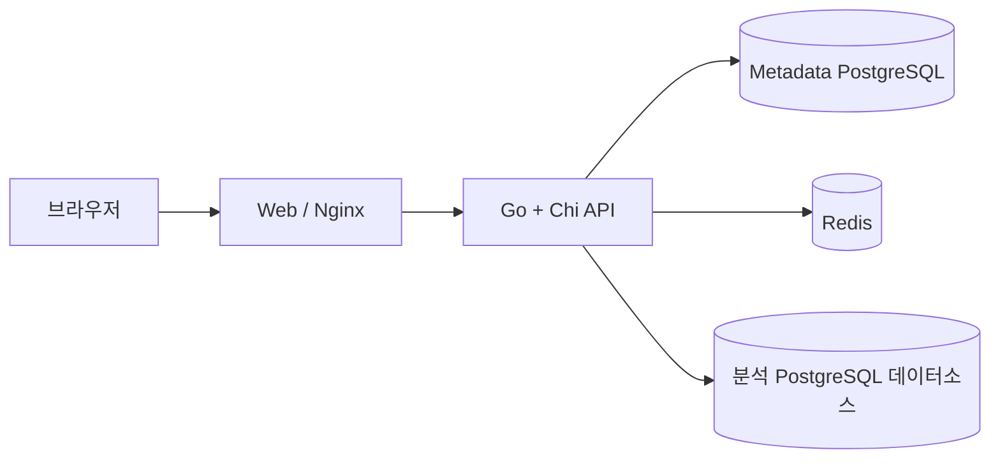

# 아키텍처 개요

Web은 단일 origin으로 `/api`를 프록시한다. API는 계약 검증, 애셋 revision, governed query를 담당한다. Metadata PostgreSQL만 영구 진실 공급원이며 Redis는 5분 query cache와 revision invalidation fan-out에 사용한다. 외부 분석 PostgreSQL은 read-only 데이터소스다.

API는 stateless하게 유지한다. 저장 transaction에 outbox를 함께 기록하고 dispatcher가 Redis로 발행한다. Redis 장애가 저장 성공을 되돌리지 않으며 미전송 outbox는 재시도한다.

현재 인증은 없고 모든 요청에 anonymous editor capability를 부여한다. 권한 검사 함수는 유지해 향후 인증 계층이 대체할 수 있게 한다.
