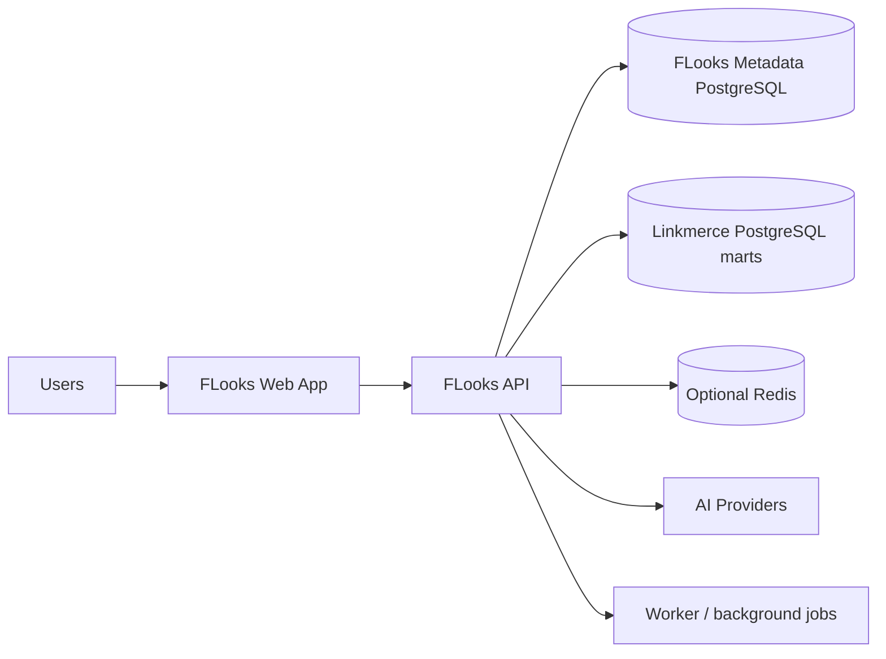

# FLooks Platform Dossier

This document explains the current FLooks structure, the rationale behind the stack choices, the alternatives that were rejected or deferred, and the forward implementation plan in one place.

The message is straightforward: FLooks is not being built on top of experimental tooling. It is an internal enterprise dashboard platform built on mainstream technologies that remain actively maintained in 2026 and are widely accepted from both hiring and operations perspectives.

## 1. Executive Summary

FLooks is intended to become the internal platform that consumes Linkmerce analytics safely and operates them with department, team, role, and dataset visibility rules.

The recommended structure is:

- Frontend: React + TypeScript + Vite SPA
- Routing: React Router
- Async data state: TanStack Query
- Tables: TanStack Table
- Charts: Apache ECharts
- UI primitives: Tailwind CSS + Radix UI style primitives
- Backend API: FastAPI
- ORM / migrations: SQLAlchemy 2.x + Alembic + psycopg 3
- Metadata database: PostgreSQL
- Local and early-stage delivery: Docker Compose
- Kubernetes migration path: Helm chart skeleton

This combination is recommended for four reasons.

1. Every part of the stack is mainstream and actively maintained.
2. It fits naturally with the Linkmerce, Airflow, dbt, and PostgreSQL reality.
3. It is not overly heavy for a one-person team, yet it does not block team growth.
4. It is well suited to FLooks-specific requirements such as dashboard editing, code-first dashboards, permission-aware data visibility, and an AI harness model.

## 2. Decision Principles

Technology is selected against explicit criteria rather than preference.

### 2.1 Mainstream ecosystem first

- Is the tool widely used?
- Are the official docs and release flow clearly active?
- Is there enough long-term maintenance talent in the market?

### 2.2 Domain fit

- Can it support the tables, charts, filters, and editing surfaces needed by a commerce analytics platform?
- Can it enforce strong data visibility and content visibility rules?

### 2.3 Controlled operational complexity

- Does it avoid forcing distributed-systems complexity too early for an internal user base?
- Can it be run comfortably with Docker Compose first and moved to Helm or Kubernetes later?

### 2.4 Alignment with Linkmerce

- Does it align naturally with the Python data ecosystem?
- Is it easy to consume Linkmerce PostgreSQL marts as read-only sources?

### 2.5 Open-source transition potential

- Does it avoid deep lock-in to a managed vendor platform?
- Can connector, panel, and harness-pack APIs later become public contracts?

## 3. Stack Decisions

This section separates what is already present in the repository from what should be added in the next implementation wave.

| Area | Current bootstrap | Locked recommendation for the next wave | Why |
| --- | --- | --- | --- |
| Frontend shell | React + TypeScript + Vite | Keep | The core product is an authenticated editor-heavy application, so interaction speed and runtime simplicity matter more than SSR. |
| Routing | Not added yet | React Router | It is a stable standard choice for React applications and fits a Vite SPA well. |
| Async data | Not added yet | TanStack Query | It is the mainstream standard for caching, refetching, polling, optimistic updates, and developer tooling. |
| Table runtime | Not added yet | TanStack Table | Its headless design fits FLooks' need for custom table behavior. |
| Chart runtime | Not added yet | Apache ECharts | It covers the enterprise chart range and extensibility that FLooks needs. |
| UI primitives | Not added yet | Tailwind CSS + Radix-style primitives | This is a widely adopted combination with a good balance of flexibility and accessibility. |
| Backend API | FastAPI skeleton | Keep | It is highly productive and aligns with the Python data ecosystem. |
| ORM | Not added yet | SQLAlchemy 2.x | It remains the most proven ORM and SQL toolkit in Python. |
| Migrations | Not added yet | Alembic | It is the de facto standard companion to SQLAlchemy. |
| PostgreSQL driver | Not added yet | psycopg 3 | It is the current standard Python PostgreSQL driver choice. |
| Auth | Not added yet | FastAPI auth layer + JWT and refresh cookie | It fits the internal V1 model and still leaves room for SSO later. |
| Jobs | Not added yet | Lightweight worker + DB outbox + optional Redis | This avoids pulling in Celery or Kafka before they are justified. |
| Metadata DB | PostgreSQL | Keep | It is the right fit for reliability, JSONB storage, and ACL-heavy metadata. |
| Local and early ops | Docker Compose | Keep | It is the most practical choice for the initial internal platform stage. |
| Future cluster packaging | Not added yet | Helm skeleton | Full Kubernetes is premature, but the migration path should exist. |

## 4. Why This Structure Should Be Kept

### 4.1 Why React + Vite should remain the default shell

The core FLooks surfaces are not public marketing pages. They are authenticated, high-interaction surfaces such as:

- the dashboard editing canvas
- the panel property editor
- the code-first dashboard editor
- the data catalog
- the permissions console
- the AI drawer

For these surfaces, the main priorities are:

- fast developer iteration
- a simple runtime model for heavy client interaction

That makes a Vite-based SPA the better default for the current stage. If a public documentation or SEO-heavy surface later becomes important, that can be added separately.

### 4.2 Why FastAPI should remain the backend framework

FLooks is not just a CRUD application. It sits on top of a data environment centered on Linkmerce, Airflow, dbt, and PostgreSQL. Keeping Python gives several practical advantages.

- The application language stays aligned with the data and operations layer.
- Pydantic-based validation maps cleanly to QuerySpec, AI tool inputs, and connector configuration.
- Early-stage delivery is faster for a one-person team.
- It remains easy to integrate with pandas, Arrow, and SQL tooling where needed.

Java or Node could also deliver the system, but in the current domain reality FastAPI is the more direct fit.

### 4.3 Why PostgreSQL should remain the metadata database

PostgreSQL serves two important purposes in the current model.

- It is the FLooks metadata store.
- It is the first-class source family consumed from Linkmerce analytics marts.

As a metadata store, PostgreSQL is attractive because it provides:

- strong transactional consistency for ACLs, memberships, and audit logs
- JSONB storage for dashboard documents and user overrides
- a mature ecosystem and proven operational model

### 4.4 Why Docker Compose should remain the early delivery model

For the expected internal user scale, Kubernetes adds more cost than value at the MVP stage. Compose remains the practical choice because:

- onboarding is simpler for developers
- local, test, and staging environments can stay close to each other
- the transition to Helm or Kubernetes later remains manageable

## 5. Alternatives Considered

### 5.1 Why the main app shell is not moving to Next.js right now

Next.js is a strong framework, but FLooks is already planned around a separate FastAPI backend and a product core centered on editor and canvas interaction rather than SSR.

Using Next.js as the primary shell at this stage would add unnecessary complexity.

- The concept of a server would be duplicated across the frontend and backend.
- The deployment model would become more complex earlier than needed.
- The team would have to absorb more concepts than the product benefits justify.

For that reason, Next.js is kept as a secondary option, while Vite remains the default shell.

### 5.2 Why Spring Boot is not the default backend choice

Spring Boot is a strong enterprise standard, but in the current FLooks context it introduces more disadvantages than benefits.

- It separates the product stack from the Linkmerce language and operations ecosystem.
- It reduces early-stage development speed for a one-person team.
- It forces rework around data-layer utilities that already align naturally with Python.

It can be reconsidered if the organization later standardizes aggressively on Java, but it is not the best default now.

### 5.3 Why NestJS is not the default backend choice

NestJS provides structure, but compared with FastAPI it is a weaker fit here.

- It splits the application language away from the Python-heavy data domain.
- Its DI, module, and decorator model adds early cognitive overhead.
- The abstraction cost rises faster than the current product needs justify.

### 5.4 Why Grafana, Kibana, or Metabase are not the product foundation

All three are valuable references, but the FLooks requirement set goes beyond typical visualization product extension.

- pixel-based layout
- code-first dashboard editing
- reusable objects hidden by dataset grants
- a custom panel sandbox contract
- governed AI harness-pack injection

These systems should remain reference architectures, not the FLooks base product.

### 5.5 Why a generic LLM orchestration framework is not a core dependency

Frameworks such as LangChain have valid use cases, but using them as a core dependency introduces fast-moving abstractions too early. FLooks instead keeps direct control over:

- the tool registry
- provider abstraction
- the authorization boundary
- the harness-pack registry

## 6. Current Repository Anatomy

```text
flooks/
├── apps/
│   ├── api/                 # FastAPI skeleton
│   └── web/                 # React + Vite shell
├── packages/
│   └── dashboard-schema/    # shared dashboard contract
├── deploy/
│   └── compose/             # local container orchestration
├── docs/
│   ├── adr/
│   ├── architecture/
│   └── playbooks/
├── docs-ko/
│   └── architecture/        # Korean user-facing documents
├── AGENTS.md
└── .github/copilot-instructions.md
```

The current structure is intentionally minimal, but the direction is correct. The following directories are likely to be added in the next implementation wave.

- `apps/worker`
- `packages/panel-sdk`
- `packages/query-spec`
- `packages/ui`
- `deploy/helm`
- `tools/`

## 7. Runtime Architecture



The core principles are:

1. FLooks is not the computation engine for Linkmerce.
2. FLooks is the governed consumer of Linkmerce analytics outputs.
3. Metadata, permissions, dashboard documents, collaboration threads, and AI policy remain owned by FLooks itself.

## 8. Governance Model

### 8.1 Permission is split into three layers

- system role: OWNER / ADMIN / EDITOR / VIEWER
- resource ACL: permissions on dashboards, library items, discussions, and requests
- data access policy: grants by user / team / department / role / workspace

### 8.2 Hidden-content rule

If a panel or object is tied to a dataset the caller cannot access, the platform should:

- hide it from discovery views
- avoid presenting it as a reusable object in the dashboard editor
- avoid surfacing it in AI tool results

## 9. Dashboard and Panel Model

FLooks borrows the by-value / by-reference idea from Kibana and the scene composition idea from Grafana, but the persistence model is simplified for FLooks requirements.

- `DashboardDocument`: top-level versioned document
- `PageDocument`: per-page layout model
- `PanelPlacement`: pixel coordinate, size, and z-index
- `PanelRef`: a library item reference or an inline panel definition

Code editing and visual editing must not use separate models. Both should read and write the same document.

## 10. Governed Query Layer

FLooks does not treat an end-user raw SQL editor as a default product surface. It centers query access on two contracts:

- Dataset manifest
- QuerySpec

This model provides several benefits.

- Panels and AI share the same data contract.
- Permission validation stays concentrated in one place.
- Connector growth does not force changes in the panel or AI call shape.
- SQL dialect differences can be absorbed by server-side translators.

See [query-spec.md](./query-spec.md) for the detailed contract.

## 11. AI Architecture

The AI assistant is not a free-form SQL chatbot. It is a governed analyst copilot.

### 11.1 Server-owned tool model

The initial tool set includes:

- `list_datasets`
- `inspect_schema`
- `run_governed_query`
- `explain_result`
- `propose_dashboard`
- `summarize_issue`

### 11.2 Harness pack

FLooks should support a harness-pack model that allows these assets to be injected without changing core source code.

- system prompt fragments
- glossary terms
- tool allowlists
- output post-processing hooks
- evaluation fixtures

The design borrows the general idea of registry, skill, and hook patterns from Claude Code, but keeps the model simpler and inside FLooks' own security boundary.

## 12. Delivery Model

### 12.1 Compose-first now

The recommended service layout is:

- web
- api
- worker
- postgres
- optional redis
- optional reverse proxy

### 12.2 Helm-ready later

Kubernetes is not the immediate operating target, but the following boundaries should be prepared early.

- env and secret contract
- liveness and readiness probe shape
- persistent volume boundary
- values file structure

## 13. Immediate Implementation Delta

Before moving into the next implementation stage, the repository should be strengthened in the following areas.

### Frontend

- React Router
- TanStack Query
- TanStack Table
- Apache ECharts
- Tailwind CSS
- Radix UI primitives or an equivalent mainstream primitive layer
- Vitest + React Testing Library

### Backend

- SQLAlchemy 2.x
- Alembic
- psycopg 3
- JWT and refresh-token support
- password hashing and email verification support
- pytest + async test stack

### Repo and delivery

- Makefile or justfile
- richer lint, format, and typecheck pipeline
- Compose health checks
- worker skeleton

## 14. Roadmap

1. Lock the documentation baseline
2. Build the auth / identity / permissions skeleton
3. Add metadata models and migrations
4. Add the Linkmerce connector and dataset manifest layer
5. Implement the QuerySpec executor
6. Implement dashboard CRUD and versioning
7. Add first-party table and scorecard panels
8. Add the request board
9. Deliver the governed AI MVP
10. Add the custom panel SDK
11. Add Helm scaffolding

## 15. Final Recommendation

The executive conclusion is clear.

- The current core structure should be kept.
- The current core structure is not yet sufficient on its own.
- What is needed now is not a foundation rewrite, but stronger mainstream library adoption and better design alignment.

The practical decision should therefore be:

1. Keep the React + Vite + FastAPI + PostgreSQL + Compose axis.
2. Add the TanStack, ECharts, SQLAlchemy, and Alembic families immediately.
3. Treat QuerySpec, the dashboard document model, and the AI harness as product-specific differentiators.
4. Keep Next.js, Spring Boot, NestJS, and BI-product-extension strategies out of the default implementation path for now.
